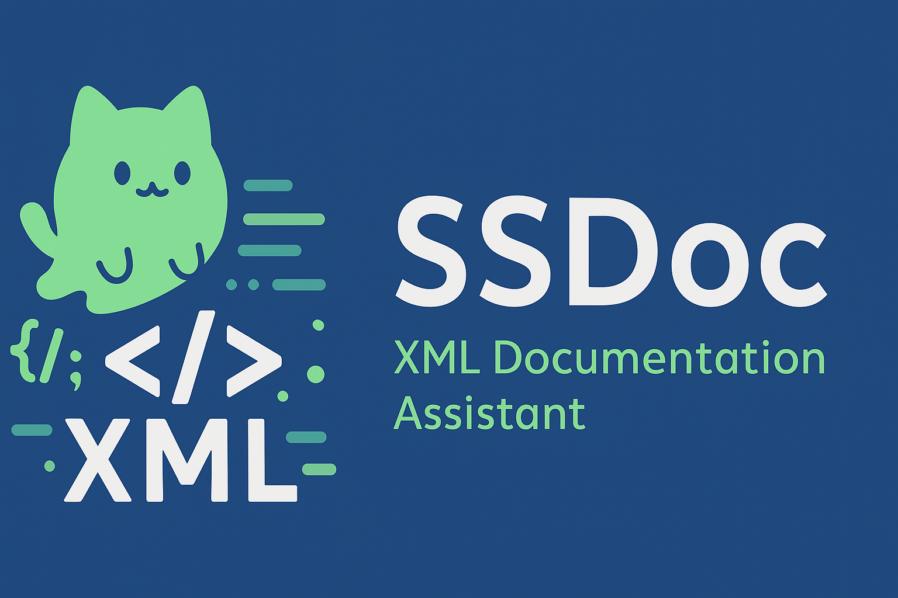

# SSDoc – XML Documentation Assistant

SSDoc is a Visual Studio extension that automatically generates **clean, StyleCop-friendly XML documentation comments** for C# code.  
It uses Roslyn APIs to detect symbols, analyze source structure, and insert documentation with precise formatting.

---

## Features

### ✔ One-click XML Documentation Generation
Automatically generates:

- `
`
- `<param>`
- `<returns>`
- `<value>`

Supported members:

- Classes  
- Interfaces  
- Structs  
- Enums  
- Methods  
- Constructors  
- Properties  

---

### ✔ StyleCop-compliant Constructor Comments
- Instance constructors  
  `Initializes a new instance of the <see cref="ClassName"/> class.`

- Static constructors  
  `Initializes static members of the <see cref="ClassName"/> class.`

---

### ✔ Intelligent Boolean Comment Generation
- Return values  
  `True if the operation succeeds; otherwise, false.`

- Parameters  
  `A value indicating whether …`

- Properties  
  `Gets/sets a value indicating whether …`

---

### ✔ Context-aware Type Documentation
Switches templates based on type kind:

- Class: Represents  
- Struct: Represents  
- Interface: Defines  
- Enum: Specifies values that represent …

---

### ✔ Identifier Word Splitting
Converts identifiers into natural English:

| Identifier | Output |
|-----------|---------|
| `semanticModel` | semantic model |
| `RetryCount` | retry count |
| `XMLReader` | XML reader |
| `ISemanticModelProvider` | semantic model provider |

---

### ✔ Roslyn-based Accurate Editing
- Finds the nearest symbol at the caret  
- Determines the exact declaration location  
- Inserts documentation safely via `TryApplyChanges`

---

## Installation

1. Open Visual Studio 2022  
2. Go to **Extensions → Manage Extensions**  
3. Search for **SSDoc**  
4. Install and restart Visual Studio

---

## Usage

1. Place your caret on any C# declaration (class, method, property, etc.)  
2. Use the command:

